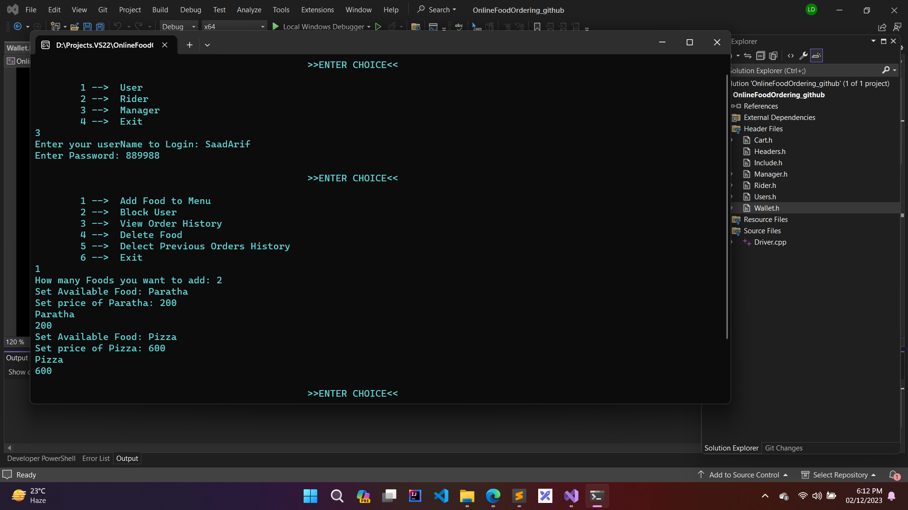
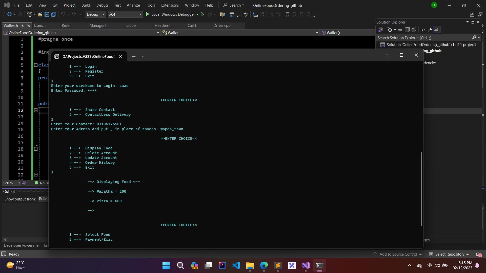
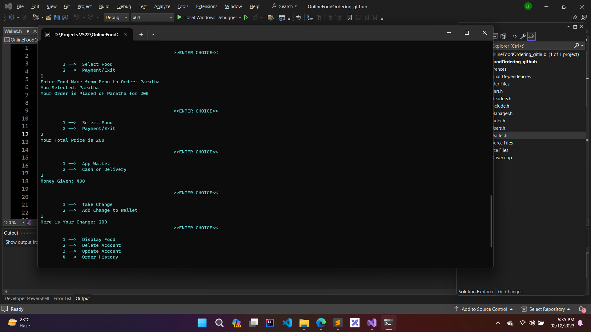
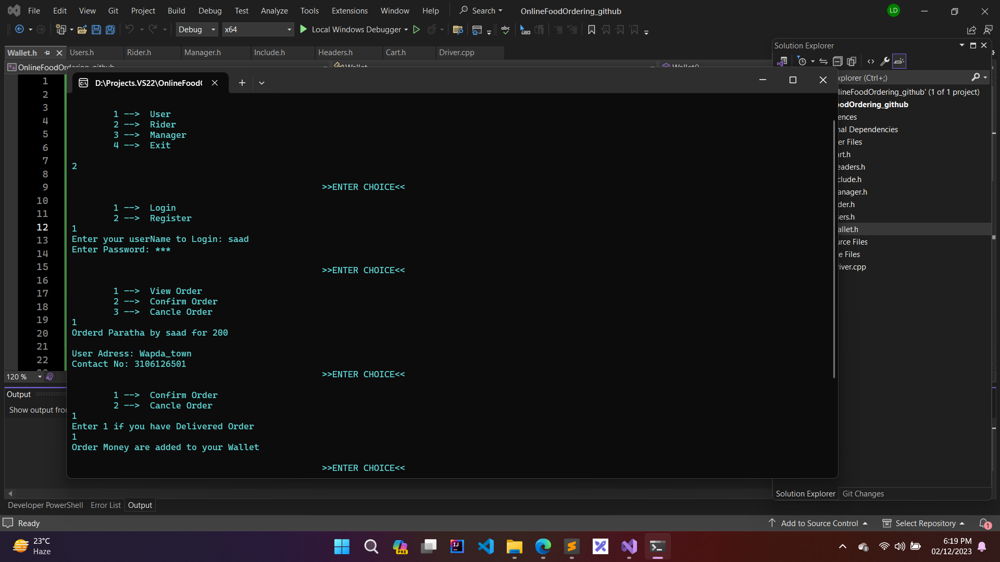

# Online-Food-Ordering
3rd-Semester Project in OOP, C++

## Manager 
### Manager can perform these functionalities
- Add Food to Menu
- Block User
- View Order History
- Delete Food
- Delete Previous Orders History
- Exit

## User
### Users can perform these functionalities
- View menu
- Update/Delete Account
- View Order History
- Place Order
- Can choose whether to share contact or not
- Can choose between payment methods

## Rider
### Rider can perfrom these functionalities
- View Orders
- Confirm Order
- Deliver Order
- Receive Payments

